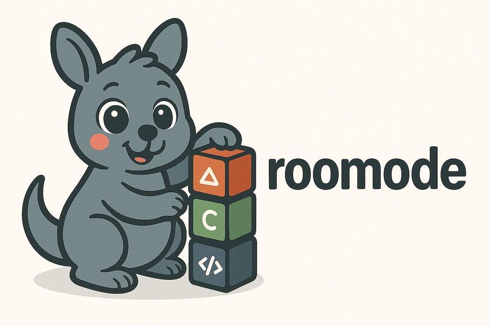

# 🧩 roomode

[](https://goreportcard.com/report/github.com/upamune/roomode)
[](https://opensource.org/licenses/MIT)



## Overview

Roomode is a CLI tool designed to manage custom modes for [RooCode](https://roo.app/), allowing you to create, list, export, and import custom AI assistant modes defined in markdown files. With roomode, you can easily organize and share your custom AI modes across different environments.

## Features

- **Create** new custom mode markdown files with proper frontmatter
- **List** all available custom modes in your `.roo/modes` directory
- **Export** all modes to a `.roomodes` JSON file for sharing or backup
- **Import** modes from a `.roomodes` JSON file into your `.roo/modes` directory
- **Version** information display

## Installation

### Using Homebrew

```bash
brew install upamune/tap/roomode
```

### Using Go

```bash
go install github.com/upamune/roomode/cmd/roomode@latest
```

### Using Prebuilt Binary

You can download prebuilt binary from [GitHub Releases](https://github.com/upamune/roomode/releases).

### From Source

```bash
git clone https://github.com/upamune/roomode.git
cd roomode
make build
```

## Usage

### Create a New Mode

Create a new custom mode markdown file with the specified slug:

```bash
roomode create translate "Translate Assistant"
```

This will create a new file at `.roo/modes/translate.md` and open it in your default editor.

### List Available Modes

View all custom modes available in your `.roo/modes` directory:

```bash
roomode list
```

### Export Modes

Export all your custom modes to a `.roomodes` JSON file:

```bash
roomode export
# or specify a custom output file
roomode export my-modes.json
```

### Import Modes

Import modes from a `.roomodes` JSON file into your `.roo/modes` directory:

```bash
roomode import
# or specify a custom input file
roomode import my-modes.json
# use force flag to overwrite existing files without confirmation
roomode import --force my-modes.json
```

### Show Version

```bash
roomode version
```

## Mode File Format

Custom modes are defined in markdown files with YAML frontmatter. Here's an example structure:

```markdown
---
name: Translate
groups:
  - read
  - command
  - edit:
      description: "Source code, translation files, and documentation"
      fileRegex: "(.*\\.(md|ts|tsx|js|jsx)$|.*\\.json$)"
roleDefinition: |
  You are Roo, a linguistic specialist focused on translating and managing localization files.
---

# 1. SUPPORTED LANGUAGES AND LOCATION
- Localize all strings into the following locale files: ca, de, en, es, fr...

# 2. VOICE, STYLE AND TONE
- Always use informal speech for all translations
```

## Contributing

Contributions are welcome! Please feel free to submit a Pull Request.

1. Fork the repository
2. Create your feature branch (`git checkout -b feature/amazing-feature`)
3. Commit your changes (`git commit -m 'Add some amazing feature'`)
4. Push to the branch (`git push origin feature/amazing-feature`)
5. Open a Pull Request

## License

This project is licensed under the MIT License - see the [LICENSE](LICENSE) file for details.
